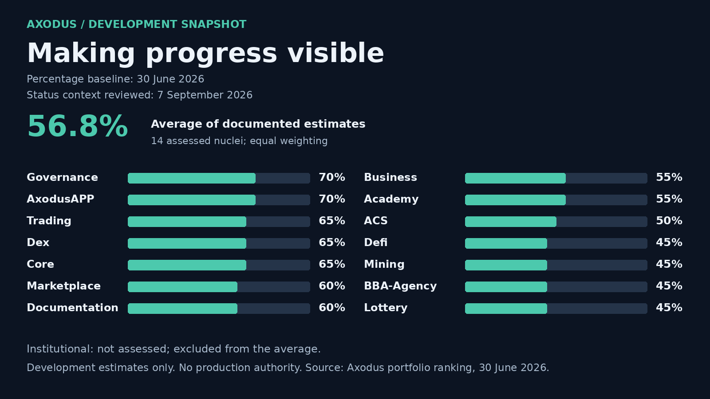

# Axodus Portfolio Development Snapshot — 7 September 2026

This snapshot makes the current documented development baseline easier to inspect across the Axodus ecosystem. It is a portfolio communication artifact, not a production or execution status report.

## What it measures

The estimate covers 14 assessed nuclei and uses the functional-completeness values in the Axodus portfolio development ranking. The equal-weight average is **56.8%**, displayed as **57%**.

Functional completeness reflects documented implementation surface, validation evidence, UI/API/SDK depth, mocks, tests, integration progress, and functional coverage. It does **not** measure production readiness, security certification, financial authority, live execution, deployment status, or investment performance.

| Evidence basis | Value |
| --- | --- |
| Assessed nuclei | 14 |
| Documented average functional completeness | 56.8% |
| Status context | 7 September 2026 |
| Percentage baseline refresh | 30 June 2026 |
| Institutional | Not assessed in the root portfolio snapshot |
| Production-authorized nuclei | 0 of 14 |

## Current direction

The current bounded portfolio priority is **Documentation: publication authority and versioning consolidation**. This work is intended to improve ownership, traceability, and evidence quality. It does not open publication, production, financial, custody, wallet-signing, on-chain, settlement, payout, trading, or other execution-sensitive capabilities.

## Reading the snapshot responsibly

A higher percentage represents more documented development evidence within this baseline. It must not be read as a recommendation, a guarantee, an operational readiness statement, or proof that any nucleus can execute financial or governance actions in production.

For ecosystem context, architecture, terminology, and risk notices, visit [Axodus Documentation](https://github.com/Axodus/Documentation). For the bounded portfolio review, see the [Weekly Portfolio Review](WEEKLY_PORTFOLIO_REVIEW_2026-09-07.md).
